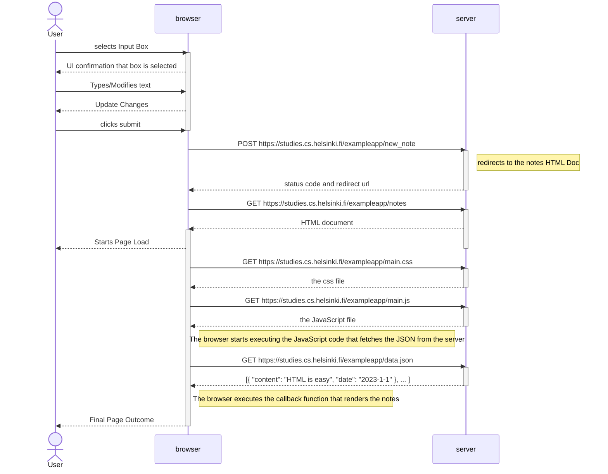

```mermaid
sequenceDiagram
    %% Assumes Page is already loaded and user just needs to input and save
    Actor User
    participant browser
        %% Instance of ??
        %% could this be an actor since this is external from the system?
    participant server
        %% Instance of express server and part of the system

    User->>browser: selects Input Box 
        %% Input box should be separate instance?
    activate browser
    browser-->>User: UI confirmation that box is selected
    User->>browser: Types/Modifies text
    browser-->>User: Update Changes
    User->>browser: clicks submit
    deactivate browser

    browser->>server: POST https://studies.cs.helsinki.fi/exampleapp/new_note
    activate server
    Note right of server: redirects to the notes HTML Doc
    server-->>browser: status code and redirect url
    deactivate server

    browser->>server: GET https://studies.cs.helsinki.fi/exampleapp/notes
    activate server
    server-->>browser: HTML document
    activate browser
    browser-->>User: Starts Page Load
    deactivate server

    browser->>server: GET https://studies.cs.helsinki.fi/exampleapp/main.css
    activate server
    server-->>browser: the css file
    deactivate server

    browser->>server: GET https://studies.cs.helsinki.fi/exampleapp/main.js
    activate server
    server-->>browser: the JavaScript file
    deactivate server

    Note right of browser: The browser starts executing the JavaScript code that fetches the JSON from the server

    browser->>server: GET https://studies.cs.helsinki.fi/exampleapp/data.json
    activate server
    server-->>browser: [{ "content": "HTML is easy", "date": "2023-1-1" }, ... ]
    deactivate server
    Note right of browser: The browser executes the callback function that renders the notes
    browser-->>User: Final Page Outcome
    deactivate browser
```