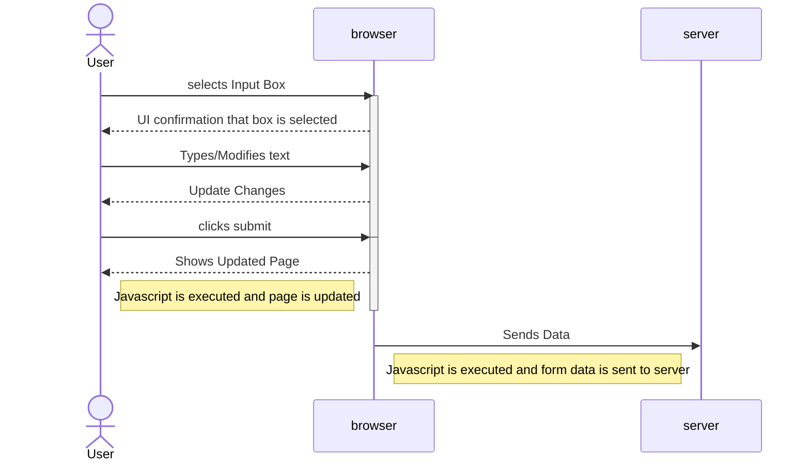

```mermaid
sequenceDiagram
    %% Assumes Page is already loaded and user just needs to input and save
    Actor User
    participant browser
        %% Instance of ??
        %% could this be an actor since this is external from the system?
    participant server
        %% Instance of express server and part of the system

    User->>browser: selects Input Box 
        %% Input box should be separate instance?
    activate browser
    browser-->>User: UI confirmation that box is selected
    User->>browser: Types/Modifies text
    browser-->>User: Update Changes
    User->>browser: clicks submit
    deactivate browser

    activate browser
    browser-->>User: Shows Updated Page
    Note left of browser: Javascript is executed and page is updated
    deactivate browser
    browser->>server: Sends Data
    Note right of browser: Javascript is executed and form data is sent to server
```